| title       | Alper                            |
| ----------- | -------------------------------- |
| author      | Alpha_Dac                        |
| description | A DIY project for a first Drone. |
| created_at  | 2026-09-10                       |

# Day 1: Define the objective and research

Design and build from scratch a 3D‑printed electric pusher motorglider inspired by modern military surveillance UAVs, at reduced scale (around 1.80 m wingspan). This is not a kit: the airframe, aerodynamics and electronics are all being developed personally, with most structural parts produced by FDM 3D printing (optimized for low weight using LW‑PLA, PETG). The goal is a stable, lightweight, repairable aircraft with a clean nose for future payloads such as gimball cameras or sensors.

Research summary – 3D‑printed electric pusher UAV (≈1.80 m wingspan)

Objectives and flight envelope

Electric pusher motorglider with a clean nose for future sensors/camera.

Wingspan: ~1 800 mm.

Target mass: 1.8–2.2 kg (ideally under 2 kg).

Wing loading: 45–60 g/dm².

Speed: 8–18 m/s, stable and gentle flight, line‑of‑sight over a large open field.

Wing and aerodynamics

Mean chord: 200–220 mm (220–230 mm in a heavily 3D‑printed version).

Aspect ratio: ~8–9; wing area: 36–41 dm².

Airfoil: NACA 4412 or Clark Y (good lift, gentle stall, easy to build).

Dihedral: 3–5°; wing incidence: +1 to +2°.

CG: 25–30% of mean chord, first flights targeted at 28%.

Configuration and layout

Slender fuselage, pointed nose, “surveillance UAV” look (not an exact replica).

High or mid‑high wing; pusher propulsion at the rear.

Tail: conventional on the first prototype (simpler), V‑tail possible later.

Key stations from the nose:

Battery bay start: 120–150 mm.

Wing leading edge: 400 mm.

Target CG: 455–460 mm.

Wing trailing edge: 610 mm.

Empennage: 1 050–1 180 mm.

End of fuselage: ~1 250 mm.

Battery on an adjustable rail (130–330 mm) to fine‑tune the CG.

Materials and structure

Wings: XPS/EPP/Depron foam or 3D‑printed skins over internal ribs.

Spars: carbon tubes Ø10–12 mm (main) and Ø4–6 mm (anti‑torsion).

Fuselage: 3D‑printed PLA/PETG segments, demountable, with battery hatch.

Motor and battery mounts: PETG/ABS (heat + vibration resistance).

Modular and repairable structure (two‑piece wings, carbon pins).

3D printing strategy

Large skins: 1 perimeter, 0% infill, internal ribs every 35–50 mm.

Mechanical parts: 3–4 perimeters, 25–40% infill, inserts/epoxy for screws.

Filaments: LW‑PLA (wings/rear), PLA (nose/fairings), PETG (motor/loads), TPU (vibration isolation).

Half‑wings split into 4–5 segments assembled over continuous carbon spars.

Pre‑test: 200 mm wing segment to validate weight and settings before printing the full aircraft.

Mass and propulsion

Optimized target: 1.8–2.4 kg → motor 3542/4250, 700–900 KV, 4S, prop 11×6–12×6, ESC 40–60 A, battery 4S 3 000–5 000 mAh.

If > 2.5 kg: larger motor (4250/5055), ESC 60–80 A, battery 4S 4 000–6 000 mAh or 6S, prop 12×6–14×7.

Target static thrust: ≥ 0.5× weight (ideally 0.7×).

Estimated endurance: 10–20 min.

Regulatory context (France/EU, 2026)

~2 kg UAV → mandatory operator registration (AlphaTango portal), operator number marked on the aircraft.

Online A1/A3 training/exam required for any aircraft over 250 g.

Over 800 g → Remote ID (electronic identification) required.

Operations in Open category, subcategory A3: away from people and urban areas.

Max altitude 120 m, visual line‑of‑sight only, no flights over crowds.

Check no‑fly zones/aerodromes before each flight; RC liability insurance recommended.

I already hold an AlphaTango operator licence, so the registration and regulatory side is prepared.

Note: Nothing here is final. All values and choices may change at any time as further research is carried out and as the 3D design and prototyping progress.
first prototype:
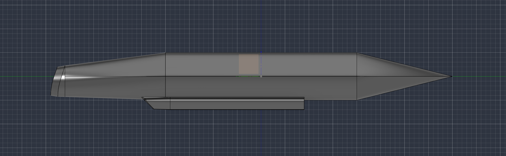
**Total time spent: 1.5 hours**

# Day 2: motorisation et aile

Wing
The drone will have a high (or slightly mid‑high) wing, straight and moderately tapered.
Wingspan: 1 800 mm.
Build: two removable half‑wings of 900 mm each.
Root chord: about 230 mm.
Tip chord: about 180 mm.
Estimated wing area: 37–40 dm² (gives roughly 45–60 g/dm² for 1.8–2.2 kg).
Airfoil: NACA 4412.
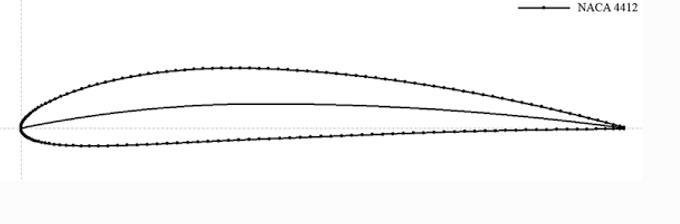
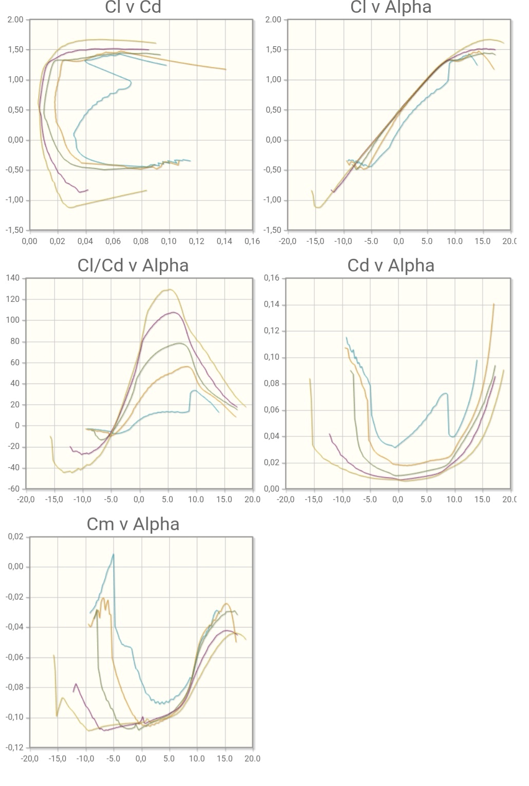
Sweep: low, between 0–5°.
Total dihedral: 4–5°.
Positive washout at the tips: about 1–2°.
Ailerons on the outer parts of the wings.

Main spars: carbon tubes 10–12 mm.
Anti‑torsion spar: carbon 4–6 mm.
Initial CG: around 27–28% of the mean chord.
This geometry was chosen to get a stable plane, easy to build and suited for slow to medium speed flight. A straight, slightly tapered wing is also more forgiving than a highly swept or delta wing.
Motor and propulsion
The drone uses a rear electric pusher setup.
Recommended configuration:
Brushless outrunner motor: 4250, around 800 KV.
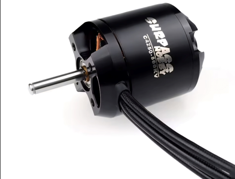
Battery: LiPo 4S, 14.8 V.
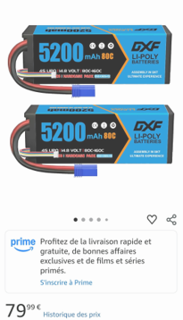
Capacity: 4 000–5 000 mAh.
Discharge rate: at least 30C, ideally 40C.
Propeller: 12×5 pusher for first tests, possibly 12×6 pusher later.
ESC: 60 A, with BEC ≥ 5 A or a separate UBEC.
Target power: about 400–600 W depending on final mass.
Desired static thrust: around 1.2–1.6 kg.

The 4250 motor was preferred over a 3542 to keep a power margin if the 3D‑printed structure ends up heavier than expected. The final propeller choice will be confirmed with a wattmeter to check current and motor/ESC temperature.
Why these choices
This wing + motor combo aims for a final mass between 1.8 and 2.2 kg, with possible operation up to about 2.5 kg after checks.
The drone should then be:
stable;
able to fly slowly;
powerful enought for safe takeoff;
suited for powered glider flight;
demountable and repairable;
compatible with 3D‑printed construction reinforced with carbon.
The battery will be mounted on an adjustable rail at the front, because the rear motor and long tail
tend to move the CG backwards.
**Total time spent: 2 hours**

# second CAD session

I spent about 1 hour and 45 minutes working on the second CAD model of my drone. I started by creating the main shape of the fuselage and positioning the wings on it.
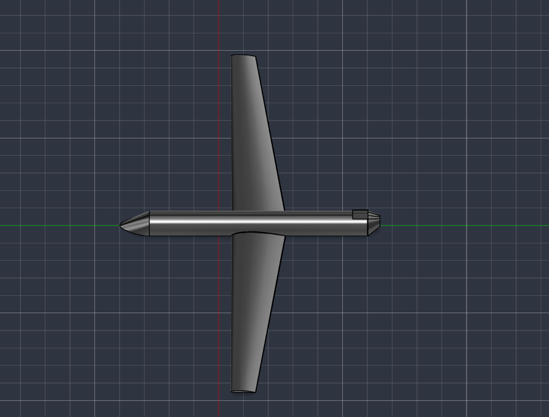

For this first version, I focused mainly on the general proportions rather than small details. I wanted to check the position of the wing, the shape of the fuselage and the overall appearance of the aircraft from above.

The wing is slightly tapered and placed across the middle of the fuselage. I also started thinking about the future propulsion system and the space needed inside the fuselage for the battery and electronics. The model is still very basic, but it gives me a first idea of the final shape.

This first CAD session helped me see that some dimensions will probably need to be adjusted later. I will have to check the wing area, the centre of gravity, the available space for the components and the way the different 3D‑printed parts will be assembled.

For now, this is only a first draft. The design will change as I continue the CAD work and learn more about the structure, aerodynamics and printing constraints.
**Total time spent: 1.75 hours**

# Day 3: CAD progress and research

Today, I spent around 4 hours working on the CAD model and 1 hour doing research about wing profiles, structural reinforcement and component layout.
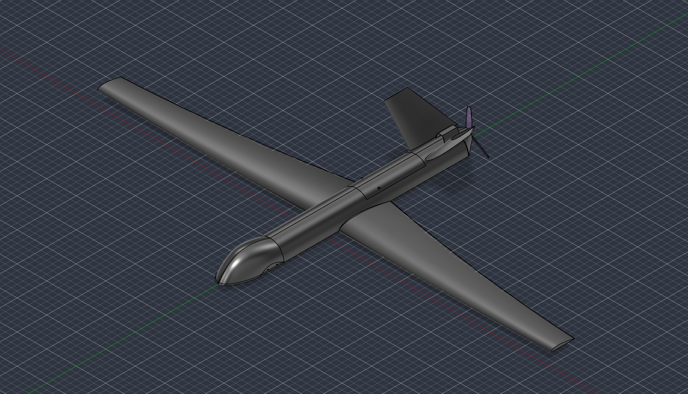
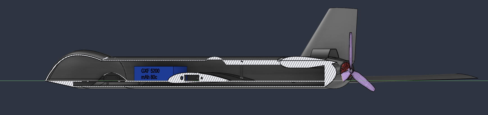
For the main wings, I chose the Clark Y airfoil.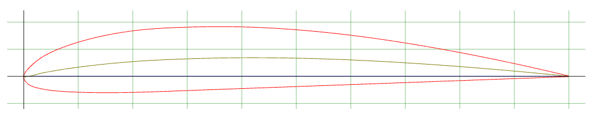
This airfoil is well suited for a slow to medium speed aircraft because it produces good lift and should help make the drone stable and easier to fly. For the horizontal stabilizers, I chose a NACA 0010 profile. Because it is symmetrical, it is more appropriate for stabilizers and should give more predictable control behavior.

During my research, I found carbon tubes that could be used as internal reinforcement:

Carbon tubes: 5 mm diameter × 250 mm length

Carbon tubes: 9 mm diameter × 500 mm length
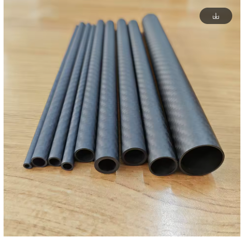
These tubes could be integrated into the wings and fuselage to reinforce the 3D‑printed structure without adding too much weight.

Changes made in CAD
I modified several parts of the aircraft design:

Improved the shape and proportions of the main wings.

Added the stabilizers using the NACA 0010 profile.
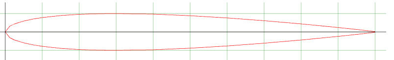
Modified the nose shape.
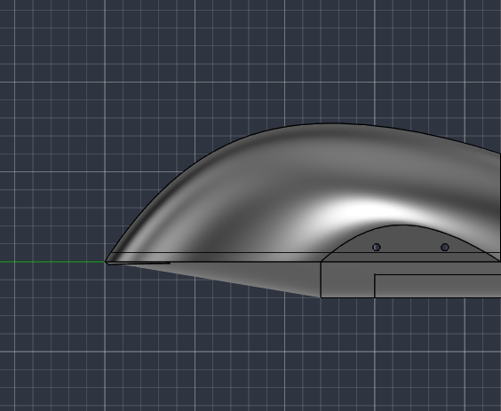
Reworked the fuselage to improve its overall shape and internal space.

Created access hatches to make assembly, maintenance and component replacement easier.

I also started a Fusion 360 assembly. In this assembly, I added simplified models of the motor, battery and propeller to check their position, the available space inside the fuselage and the general layout of the aircraft. This is useful before designing the final mounts and internal supports.

The design is still in progress, and several dimensions may change during future research and CAD work. The next steps are to check the centre of gravity, plan the carbon tube locations, design the component mounts and define how all the 3D‑printed sections will connect together.
